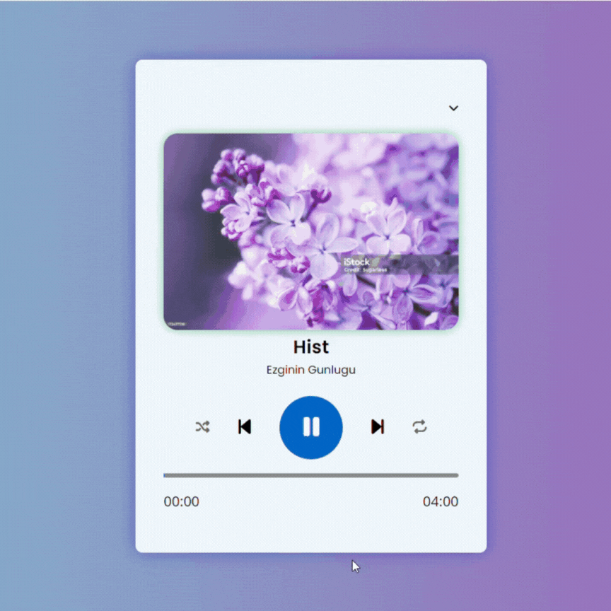

### Music Player

This project is a Music Player developed using HTML, CSS, and JavaScript. The player allows you to listen to music in sequence or shuffle mode, skip forward or backward, and play or pause tracks. It displays the song's title and artist's name for each track. The functionality to control music playback is implemented using JavaScript.

### Features

- Play/Pause Functionality: Easily start or stop the music with the play/pause buttons.
- Next/Previous Track: Skip to the next or previous track in the playlist.
- Shuffle Mode: Play songs in random order with the shuffle feature.
- Track Information Display: Displays the artist’s name and the song title for each track.
- JavaScript-Powered Control: Controls the playback, forward, and rewind actions using JavaScript.

### Technologies Used

- HTML: Structures the music player interface.
- CSS: Styles the player, providing an intuitive and clean user interface.
- JavaScript: Handles the logic for music playback, including starting, stopping, track selection, and shuffle functionality.

## Gif

